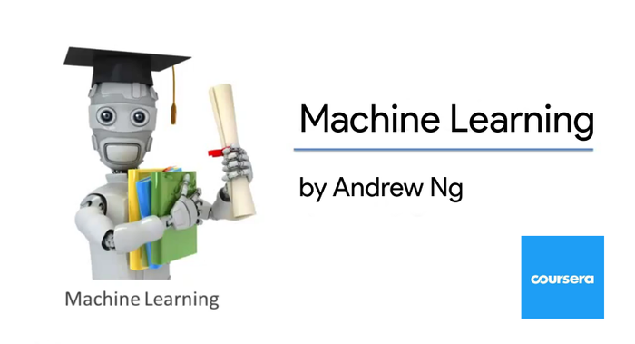

# Machine Learning Stanford (Coursera)
taught by Andrew Ng

## Intro
"Machine learning is the science of getting computers to act without being explicitly programmed. In the past decade, machine learning has given us self-driving cars, practical speech recognition, effective web search, and a vastly improved understanding of the human genome."

Topics included in the course : 
- **Supervised learning** : parametric/non-parametric algorithms, support vector machines, kernels, neural networks. 
- **Unsupervised learning** : clustering, dimensionality reduction, recommender systems, deep learning. 
- **Best practices in machine learning** : bias/variance theory, innovation process in machine learning and AI. 
- **Case studies and applications** : smart robots (perception, control), text understanding (web search, anti-spam), computer vision, medical informatics, audio, database mining, ...

## Content
- Lecture Slides
- Programming projects

## Certificate

## References
`Machine Learning - Stanford` : <https://www.coursera.org/learn/machine-learning>
